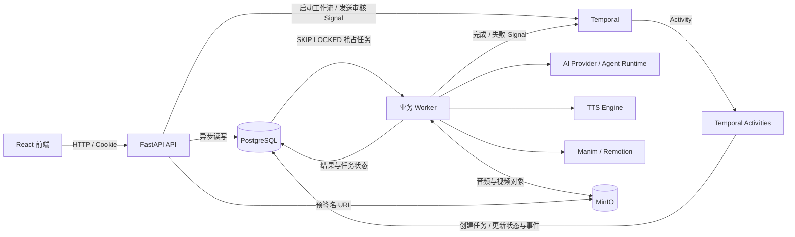
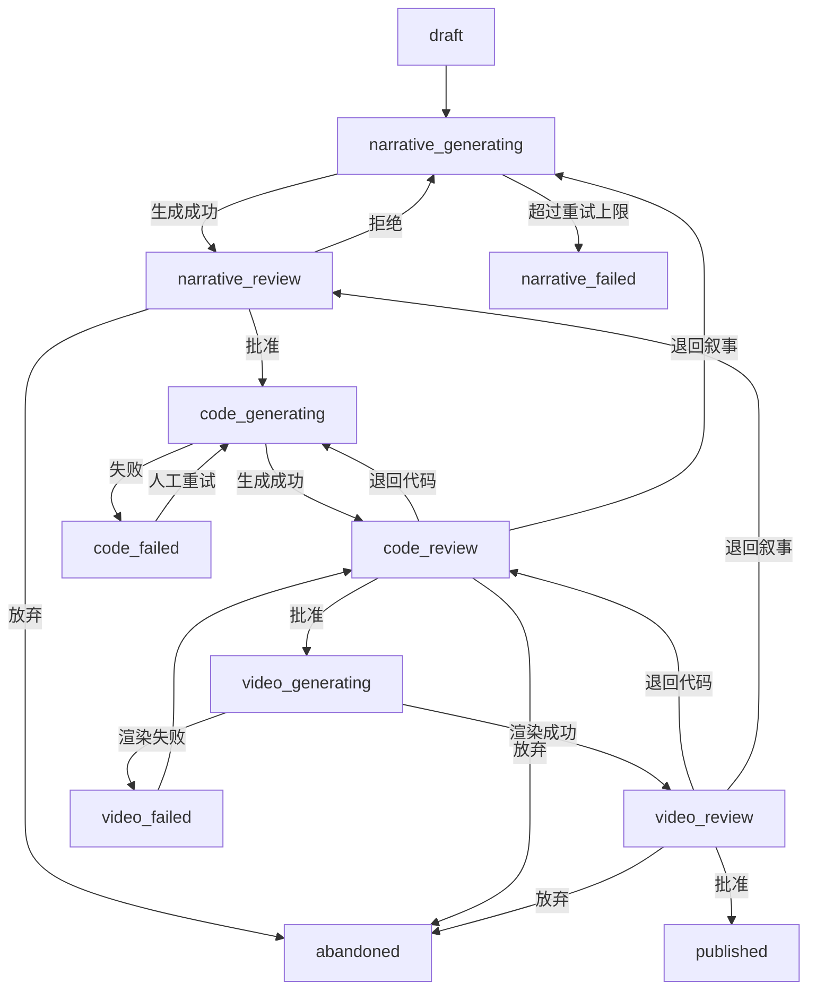

# AI 视频生产平台后端代码设计架构

> 本文基于 `backend/` 当前代码实现整理，用于说明后端的模块边界、运行时拓扑、核心数据流、扩展机制与现存约束。它描述的是“代码现在如何工作”，不是早期 Sprint 设计稿。

## 1. 架构目标与核心原则

后端负责把“选题 → 叙事 → 代码 → 视频”组织成一个可暂停、可审核、可回退、可追溯的长流程，并将 AI、TTS、渲染等不稳定且耗时的外部能力隔离在可替换的引擎与 Worker 中。

当前实现遵循以下核心原则：

1. **Temporal 是流程状态的权威来源**：负责阶段编排、等待人工审核和处理回退；`video_projects.status` 是供 API 快速查询的状态镜像。
2. **数据库任务表隔离耗时执行**：Temporal Activity 只创建 `worker_tasks`，实际 AI、TTS 和渲染由独立 Worker 执行。
3. **人工审核是硬闸门**：叙事、代码、视频三道审核均通过 Temporal Signal 驱动，不能由正常工作流自动跳过。
4. **镜头是最小内容单元**：叙事、语音、语义节拍、代码均按 `scenes[]` 组织。
5. **内容版本不可变，项目指针可变**：每次生成或审核编辑创建新版本，项目表只指向当前版本；渲染任务会冻结代码版本，避免受后续编辑影响。
6. **不使用数据库外键**：所有 `_id` 关联均由应用层校验、查询和级联维护。
7. **外部能力可插拔**：AI Provider、生成策略、TTS 和渲染均通过工厂或 Protocol 抽象切换。
8. **生成输入可追溯**：Prompt 组件、引擎规则哈希、执行模式和 Agent trace 会冻结到版本快照中。

## 2. 运行时总体架构



本地开发时，`app.workers.combined_worker` 在同一进程中同时运行：

- Temporal Workflow Worker；
- Temporal Activity Worker；
- `NarrativeWorker`；
- `CodeWorker`；
- `RenderWorker`。

逻辑上这些组件彼此独立，后续可以按任务类型拆成多个进程或部署单元。

## 3. 代码分层与目录职责

```text
backend/app/
├── main.py                 # FastAPI 入口、生命周期、路由注册
├── config.py               # 环境变量与运行参数
├── db.py                   # API 异步会话 + Worker 同步会话
├── auth.py / security.py   # Cookie 鉴权、令牌、密码和权限
├── deps.py                 # Temporal Client 依赖
├── api/                    # HTTP 接口与应用层编排
├── schemas/                # Pydantic 请求/响应契约
├── models/                 # SQLAlchemy ORM 模型
├── workflows/              # Temporal Workflow 与 Activities
├── workers/                # 数据库任务消费者
├── services/               # 业务规则、校验、快照和执行策略
│   └── strategies/         # Prompt / Agent 生成策略
├── engines/                # AI、TTS、Render 外部能力适配层
├── storage.py              # MinIO 对象存储适配
├── codegen_rules.py        # 代码生成规则
└── video_format.py         # 画幅与分辨率映射
```

### 3.1 接口层：`api/` 与 `schemas/`

接口层提供 HTTP 契约、鉴权、参数校验和应用流程入口。主要资源如下：

| 路由前缀 | 职责 |
|---|---|
| `/api/auth` | 登录、退出、当前用户 |
| `/api/users` | 用户管理与启停，仅管理员可操作关键接口 |
| `/api/topics` | 选题 CRUD、AI 脑暴、流式研究对话 |
| `/api/projects` | 项目、版本、视频地址、审核、阶段重置、TTS 重生成 |
| `/api/prompt-components` | Prompt 风格组件维护与 AI 辅助生成 |
| `/api/style-templates` | 风格模板/风格库管理 |
| `/api/ai-model-settings` | Provider、模型、业务路由和执行模式配置 |
| `/api/ai-call-records` | AI 调用记录、用量和成本查询 |
| `/api/tts-settings` | TTS 引擎、音色和试听管理 |
| `/api/worker-tasks` | Worker 任务查看（当前为占位接口） |

API 使用异步 SQLAlchemy Session。项目创建接口在写入项目后启动 Temporal Workflow；审核接口先校验并保存人工编辑产生的新版本，再发送对应 Signal；项目删除接口会先终止仍在运行的 Workflow，再由应用层删除关联数据。

目前部分较重的业务逻辑仍直接位于路由模块中，例如审核版本派生、单镜头 TTS 重生成、项目级联删除和 AI 代码修复。长期演进时可继续下沉到 `services/`，使路由只保留协议转换和调用编排。

### 3.2 工作流层：`workflows/`

`VideoProductionWorkflow` 是单个视频项目的长生命周期状态机，Workflow ID 固定为：

```text
video-production-{project_id}
```

Workflow 自身只做确定性的流程控制：

- 更新项目状态；
- 提交数据库任务；
- 等待 Worker 结果 Signal；
- 等待人工审核 Signal；
- 根据审核结论进入下一阶段、重试、回退或终止。

`activities.py` 负责所有需要访问数据库的副作用，包括：

- 更新 `video_projects.status` 并追加 `project_events`；
- 创建叙事、代码、渲染任务；
- 冻结 Prompt 快照、拒绝上下文和代码版本；
- 更新阶段重试计数；
- 取消卡住任务并重新入队。

### 3.3 Worker 层：`workers/`

`BaseWorker` 提供统一任务消费框架：

1. 从 `worker_tasks` 中筛选本 Worker 支持的任务类型；
2. 使用 `FOR UPDATE SKIP LOCKED` 原子抢占最早任务；
3. 调用子类 `_execute()`；
4. 保存成功输出或失败原因；
5. 向目标 Temporal Workflow 发送结果 Signal。

三个业务 Worker 的职责如下：

| Worker | 任务类型 | 核心输出 |
|---|---|---|
| `NarrativeWorker` | `generate_narrative` | `NarrativeVersion`、逐镜头 TTS、语义节拍对齐 |
| `CodeWorker` | `generate_code` | `CodeVersion`、渲染代码校验与自动修复结果 |
| `RenderWorker` | `render_video` | `VideoAsset`、视频文件、渲染日志与错误信息 |

任务在执行期间被人工取消时，Worker 会丢弃执行结果，不再提交成功或失败 Signal。当前工作流创建的业务任务将 `max_retries` 设为 `0`，阶段重试主要由 Workflow 控制，而不是由 `BaseWorker` 自动重试。

### 3.4 业务服务与策略层：`services/`

服务层承载不属于 HTTP、工作流或基础引擎的业务规则：

- `narrative_validator.py`：校验并规范化叙事镜头、旁白与 beats；
- `beat_aligner.py`：将 TTS 字级时间戳映射到语义节拍；
- `prompt_bundle.py`：解析风格组件并创建 Prompt 快照；
- `execution_mode.py`：按“项目配置 → 业务全局配置 → 默认值”解析执行模式；
- `strategies/`：将“如何生成内容”与 Worker 生命周期解耦。

策略层当前支持：

| 业务 | `prompt` 模式 | `agent` 模式 |
|---|---|---|
| 叙事生成 | `PromptNarrativeStrategy` | 尚未实现，规范化后仍使用 Prompt 策略 |
| 代码生成 | `PromptCodegenStrategy` | `AgentCodegenStrategy` |

Prompt 代码生成会先调用 AI 生成逐镜头代码，再调用渲染引擎的 `validate_code()` 做最多两轮自动修复。Agent 代码生成通过 Agent Runtime 和隔离工作目录读写逐镜头代码，并记录模型、工具调用、用量、成本和校验结果。

### 3.5 引擎层：`engines/`

引擎层把外部实现统一为内部稳定接口。

#### AI 引擎

`AIProvider` 定义选题脑暴、研究、叙事生成、代码生成、代码修复和风格辅助等业务能力；`ChatAIProvider` 实现 Prompt 构造、结构化输出和结果解析。

底层 Chat Client 当前支持：

- DeepSeek；
- OpenRouter；
- OpenAI；
- Gemini；
- 豆包；
- Stub。

Provider 选择优先读取数据库中的业务配置，找不到时回退到 `default` 业务配置，再回退到环境变量；仍无有效配置时使用 Stub。`RecordingChatClient` 在调用边界统一记录输入、输出、Token、耗时、费用和异常。

#### TTS 引擎

`TTSEngine` 以 `TTSRequest → TTSResult` 为稳定契约。当前实际实现为火山引擎 TTS，配置和音色从数据库动态读取。叙事生成后最多并发合成 3 个镜头，音频存入 MinIO，字级时间戳写回镜头 JSON。

#### 渲染引擎

`RenderEngine` 统一提供代码校验和整体渲染能力。当前实现：

- `ManimRenderEngine`：Python AST 静态检查、跨镜头名称处理、整体脚本构建与渲染；
- `RemotionRenderEngine`：生成 TSX、执行 TypeScript 校验并渲染视频。

所有镜头在渲染阶段整体提交，保证镜头之间的共享状态和过渡依赖能够成立。

### 3.6 基础设施层

- **PostgreSQL**：业务数据、内容版本、任务队列、状态镜像和审计记录；
- **Temporal**：持久化工作流、Signal 和重放；
- **MinIO**：镜头音频与最终视频对象；
- **Alembic**：数据库结构和内置风格数据迁移；
- **FastAPI Lifespan**：启动时连接 Temporal，并在空用户库中按环境变量引导创建管理员。

数据库访问刻意分为两套：FastAPI 使用 `asyncpg` 异步会话，Temporal Activity 和业务 Worker 使用 `psycopg2` 同步会话。

## 4. 核心生产流程

### 4.1 主流程状态机



关键 Signal：

| Signal | 发送方 | 含义 |
|---|---|---|
| `narrative_generated` | `NarrativeWorker` | 叙事和 TTS 已完成或失败 |
| `narrative_review` | 审核 API | 叙事审核结论 |
| `code_generated` | `CodeWorker` | 代码版本已完成或失败 |
| `code_review` | 审核 API | 代码审核或渲染失败后的处理结论 |
| `render_completed` | `RenderWorker` | 视频资产已完成或失败 |
| `video_review` | 审核 API | 视频审核结论 |
| `cancel` | 已定义但当前主流程未消费 | 预留取消信号 |

### 4.2 叙事生成链路

```text
Workflow
  → Activity 创建 generate_narrative 任务
  → 冻结选题、风格组件、Prompt 快照、拒绝上下文和执行模式
  → NarrativeWorker 调用叙事策略
  → 校验 scenes / fact_checks
  → 创建 NarrativeVersion
  → 并发生成逐镜头 TTS，上传 MinIO
  → 根据字级时间戳对齐 beats
  → 更新项目 current_narrative_version_id
  → 发送 narrative_generated Signal
  → Workflow 进入 narrative_review
```

审核时若编辑叙事，会派生新 `NarrativeVersion`。为了避免旁白文本与音频错位，改变 beat cue 的编辑必须先通过单镜头 TTS 重生成接口重新生成音频与时间轴。

### 4.3 代码生成链路

代码任务必须读取当前叙事版本中的 Prompt 快照，而不是重新读取可变风格配置，从而保证叙事和代码使用同一套生成语境。

```text
Workflow
  → Activity 创建 generate_code 任务
  → CodeWorker 读取当前 NarrativeVersion
  → 校验 scenes 是否满足代码生成约束
  → 按 execution_mode 选择 Prompt 或 Agent 策略
  → 生成并校验逐镜头代码
  → 创建 CodeVersion，更新 current_code_version_id
  → 发送 code_generated Signal
  → Workflow 进入 code_review
```

人工修改代码或事实核查结论时同样派生新 `CodeVersion`，不会覆盖原版本。

### 4.4 视频渲染链路

创建渲染任务时，`worker_tasks.code_version_id` 会冻结审核通过的代码版本。`RenderWorker` 不使用随后可能变化的 `project.current_code_version_id` 决定输入。

```text
Workflow
  → Activity 创建 render_video 任务并冻结 code_version_id
  → RenderWorker 创建 rendering 状态的 VideoAsset
  → 下载各镜头音频
  → 合并镜头并调用指定渲染引擎
  → 上传 MP4 到 MinIO
  → 更新 VideoAsset 与 current_video_asset_id
  → 发送 render_completed Signal
  → Workflow 进入 video_review
```

渲染失败会保存 `render_log` 和 `error_message`，状态短暂进入 `video_failed` 后回到 `code_review`，由用户决定修改代码、退回叙事或重新提交渲染。

## 5. 数据模型设计

当前共有 17 个 ORM 模型，按职责可分为以下几组。

### 5.1 生产主链路

| 表 | 角色 | 关键设计 |
|---|---|---|
| `topics` | 选题与研究上下文 | 评分、标签、研究对话 JSON |
| `video_projects` | 项目聚合根与状态镜像 | 当前版本指针、引擎配置、Workflow ID |
| `narrative_versions` | 不可变叙事版本 | scenes、fact_checks、Prompt 快照 |
| `code_versions` | 不可变代码版本 | scenes、渲染引擎、Prompt/Agent trace |
| `video_assets` | 单次渲染资产 | 冻结代码版本、文件 key、日志、错误 |
| `worker_tasks` | 数据库任务队列 | 输入/输出、抢占者、重试、Signal 路由 |
| `project_events` | 追加式项目时间线 | 状态变化、审核结论、精确内容版本 |
| `performance_records` | 发布表现 | 播放、完播、互动与评论摘要 |

### 5.2 生成配置与审计

| 表 | 角色 |
|---|---|
| `prompt_components` | 叙事风格、配色、动画、范例等 Prompt 组件 |
| `style_templates` | 一组风格组件的可复用组合 |
| `ai_model_providers` | Provider 地址、密钥和超时配置 |
| `ai_provider_models` | Provider 下的具体模型、Token 上限与计价 |
| `ai_business_model_configs` | 业务到模型及执行模式的路由 |
| `ai_call_records` | AI 请求、响应、用量、费用、耗时和错误审计 |
| `tts_engine_configs` | TTS Provider 实例配置 |
| `tts_voices` | TTS 引擎下的逻辑音色到 speaker ID 映射 |
| `users` | 用户、角色与启停状态 |

### 5.3 关联与一致性策略

系统不声明数据库外键，采用以下应用层约束：

- 创建项目时检查 Topic、TTS 引擎、音色和风格组件存在；
- 删除 Topic 前检查是否仍有项目引用；
- 删除项目时显式删除其任务、事件、表现、资产和版本；
- 获取版本和资产时同时校验 `project_id` 归属；
- 渲染 Worker 校验冻结代码版本确实属于当前项目；
- 审核事件和状态事件保存当时的内容版本 ID/版本号；
- 当前指针仅用于读取最新内容，不作为历史事件或已排队渲染的输入依据。

这种方式减少数据库层耦合，但要求所有新增写路径都主动维护关联完整性和级联规则。

## 6. Prompt、模型与执行模式

### 6.1 Prompt 快照

项目的 `style_config` 只保存组件 ID。叙事任务入队时，`build_prompt_snapshot()` 会解析实际 Prompt 文本并冻结：

- 基础 Prompt 版本；
- 渲染引擎；
- 引擎规则文件 SHA-256；
- 每类组件的 ID、名称、完整文本、更新时间和 SHA-256。

代码生成继续使用叙事版本上的快照，因此之后修改 Prompt 组件不会改变已开始项目的生成语义。

### 6.2 AI 业务路由

当前业务键包括：

```text
default
topic_brainstorm
topic_research
narrative_generation
code_generation
code_repair
style_assistant
```

每个业务可以在数据库中绑定独立模型。模型选择顺序为：

```text
指定业务配置 → default 业务配置 → 环境变量 Provider → Stub
```

### 6.3 执行模式

执行模式的解析顺序为：

```text
项目 execution_mode → 业务全局 execution_mode → prompt
```

非法值统一回退到 `prompt`。当前仅代码生成真正实现了 Agent 分支；叙事生成即使配置为 `agent`，仍执行 Prompt 策略。

## 7. 鉴权与权限

后端使用 HttpOnly Cookie 携带自签名 HS256 Token：

- 密码使用 PBKDF2-SHA256 和随机 salt；
- Token 包含用户 ID、用户名、角色、启停状态和过期时间；
- 普通业务接口要求 active user；
- 用户管理和部分配置操作要求 admin；
- 首次启动且用户表为空时，可通过环境变量引导创建管理员。

当前 Token 中会内嵌签发时的 `role` 和 `is_active`，请求鉴权不会每次回查数据库。因此用户被停用或角色变化后，旧 Token 中的信息会持续到过期或重新登录。这是现有实现需要关注的权限时效边界。

## 8. 失败处理、重试与恢复

系统有三层失败处理：

1. **Temporal Activity 重试**：状态更新和任务提交 Activity 默认最多尝试 3 次；
2. **Workflow 阶段重试**：叙事/代码生成失败后由 Workflow 决定是否重新创建任务；
3. **Worker 任务重试**：`BaseWorker` 支持按 `max_retries` 回到 pending，但当前主链路任务配置为 0。

恢复接口支持以下卡住阶段：

| 当前状态 | 取消任务 | 恢复行为 |
|---|---|---|
| `narrative_generating` | `generate_narrative` | 重新提交叙事任务 |
| `code_generating` | `generate_code` | 重新提交代码任务 |
| `code_failed` | `generate_code` | 状态回到 `code_generating` 并重新提交 |
| `video_generating` | `render_video` | 重新提交渲染任务 |

恢复操作会把同项目同类型的 pending/processing 任务标为 cancelled，并追加操作事件。它依赖 Workflow 仍在等待相应结果 Signal。

## 9. 配置、启动与部署边界

### 9.1 主要配置类别

- 数据库异步/同步连接；
- Temporal 地址与 Task Queue；
- MinIO 内部地址、公开签名地址、Bucket 与凭据；
- 登录 Token、Cookie 与引导管理员；
- 各 AI Provider 的地址、模型、Token 限制和计价；
- TTS 默认凭据；
- Manim/Remotion 超时与模板目录；
- Agent 模型、轮次、预算、思考模式和超时；
- CORS 来源。

### 9.2 进程边界

生产环境至少应区分：

1. FastAPI 服务；
2. Temporal Workflow/Activity Worker；
3. AI/TTS Worker；
4. 渲染 Worker。

渲染 Worker 依赖 Manim、Remotion/Node、字体、FFmpeg 等运行环境，资源与安全边界不同于普通 API 服务。当前 `combined_worker` 更适合本地开发和小规模部署。

## 10. 测试架构

`backend/tests/` 已按模块覆盖：

- API、鉴权、Schema 和 ORM；
- Temporal Workflow 与 Activities；
- BaseWorker、叙事、代码和渲染 Worker；
- AI Provider、结构化输出、调用审计和模型路由；
- Prompt/Agent 策略与 Agent Sandbox；
- Manim/Remotion 渲染引擎；
- TTS、音频时长、节拍对齐与对象存储。

标准测试命令：

```bash
cd backend
/Users/peng/.local/bin/uv run pytest tests/ -v
```

## 11. 当前实现边界与演进建议

以下是从当前代码结构可直接观察到的边界，新增功能时应优先保持兼容：

1. **路由层仍偏重**：将审核、版本派生、项目级联和 TTS 重生成下沉到服务层，可降低 API 与持久化细节的耦合。
2. **无外键要求显式维护完整性**：新增实体或删除路径时必须同步补齐归属校验和级联清理测试。
3. **项目状态是镜像而非权威状态**：不能仅改数据库状态来推动生产流程，必须通过 Workflow/Signal 完成状态迁移。
4. **取消 Signal 尚未接入主循环**：目前项目删除使用 Workflow terminate，任务取消由重置接口直接修改任务状态。
5. **叙事 Agent 模式尚未实现**：配置层已允许 `agent`，但叙事策略仍固定为 Prompt。
6. **部分接口仍为占位**：发布表现写入和 Worker 任务查看当前返回 TODO；使用前需补齐持久化与查询流程。
7. **同步数据库操作运行在异步 Worker 方法中**：高并发时需关注事件循环阻塞，可考虑线程池或进程级 Worker 隔离。
8. **鉴权状态存在 Token 时效窗口**：若要求停用立即生效，应在请求时回查用户状态或引入 Token 撤销机制。
9. **数据库配置中包含外部服务密钥**：生产环境应补充加密存储、脱敏展示和密钥轮换机制。

## 12. 新功能的正确落点

| 变更类型 | 建议位置 |
|---|---|
| 新 HTTP 资源或协议字段 | `api/` + `schemas/` |
| 新数据库实体 | `models/` + Alembic migration |
| 新流程阶段、审核闸门或回退路径 | `workflows/video_production.py` + Activities |
| 新耗时任务 | `worker_tasks` 任务类型 + `BaseWorker` 子类 |
| 新生成算法或执行方式 | `services/strategies/` |
| 新 AI 厂商 | `engines/ai/` Client + factory 注册 |
| 新渲染后端 | `engines/render/` + factory + engine spec |
| 新 TTS 厂商 | `engines/tts/` + 配置装配 |
| 跨接口业务校验或版本规则 | `services/` |
| 新音视频文件 | `storage.py` 统一管理对象 key 和访问方式 |

新增生产阶段时，应同时考虑 Workflow 状态、Activity 副作用、Worker 任务、项目事件、人工审核、失败恢复、API 展示和测试，避免只修改其中一个状态镜像。
