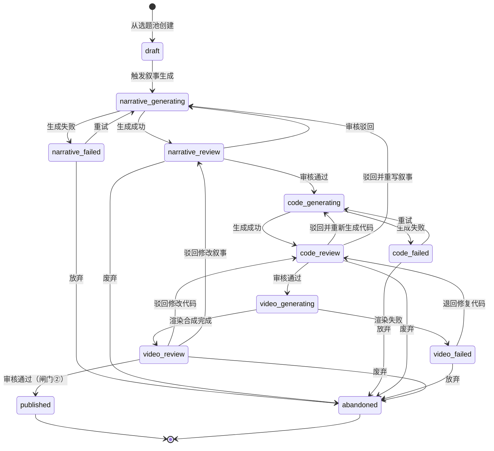

# AI 知识视频生产工作流平台 — 产品需求文档

> 版本: v2.0 | 日期: 2026-06-23 | 状态: 初稿

---

## 1. 产品概述

### 1.1 产品定位

本平台是一套面向自媒体创作者的「AI 驱动知识视频」端到端生产工作流系统。将「选题发现 → 叙事生成与审核 → 代码生成与审核 → 视频渲染合成 → 成片审核 → 发布 → 数据回流」这一完整内容闭环组织为可追溯、可重试、有人工卡点的持久化工作流，在保证内容质量的前提下显著提升生产效率。

### 1.2 核心设计约束

| 编号 | 约束 | 说明 |
|------|------|------|
| C1 | 质量优先于速度 | 平台是半自动流水线，不是无人工厂。两道人工闸门是不可跳过的硬约束 |
| C2 | 「是解释不是定论」 | 每条关键论断必须带来源、置信度、假设条件，作为一等公民的结构化数据 |
| C3 | 渲染引擎可插拔 | Manim、Remotion 乃至未来新引擎通过统一接口接入，业务层不感知具体引擎 |
| C4 | 数据回流形成闭环 | 发布后的播放、完播率、评论数据反哺选题池，让系统越跑越准 |
| C5 | 镜头是最小原子单位 | 脚本按镜头组织，TTS 按镜头生成，审核可精确到镜头级别。渲染时所有镜头代码作为整体提交（因镜头间存在依赖） |

### 1.3 用户角色

| 角色 | 说明 | 主要操作 |
|------|------|----------|
| 创作者（Owner） | 平台的主要使用者，即自媒体账号运营者 | 管理选题、触发生产、审核内容、发布视频 |
| 协作者（Collaborator） | 可选，未来扩展角色 | 参与审核、标注事实 |
| 系统（System） | 工作流引擎和 AI 服务 | 自动生成、渲染、重试 |

---

## 2. 功能模块与优先级

按 P0（MVP 必须）→ P1（第二迭代）→ P2（锦上添花）排列。

### P0 — MVP（第一个可跑通的闭环）

| 编号 | 模块 | 功能说明 |
|------|------|----------|
| F-01 | 选题池管理 | 手动或 AI 批量添加选题；四维度打分；状态管理（待评估、已入库、已使用、已废弃） |
| F-02 | 视频项目状态机 | 核心实体，统管单条视频从创建到发布的全生命周期 |
| F-03 | 叙事与代码生成 | AI 先生成按镜头组织的叙事与事实核查表，审核后再生成渲染代码 |
| F-04 | 内容审核（闸门①） | 人工逐条核查事实核查表；通过/驳回（带结构化原因）；驳回自动触发脚本重生成 |
| F-05 | 视频生成 | 单个任务内完成：TTS 生成 → 音频注入渲染代码 → 整体渲染出带声音的成片；失败自动重试（最多 3 次） |
| F-06 | 视频审核（闸门②） | 预览成片；通过/驳回（退回重写脚本）/废弃 |
| F-07 | 发布与数据回流 | 标记已发布；手动录入表现数据；数据回写选题评分 |

### P1 — 第二迭代

| 编号 | 模块 | 功能说明 |
|------|------|----------|
| F-08 | 看板视图 | 类 Kanban 看板，展示各阶段视频项目卡片 |
| F-09 | 批量操作 | 批量触发内容生产、批量审核 |
| F-10 | 选题 AI 助手 | AI 根据历史表现数据主动推荐选题 |
| F-11 | 版本历史 | 脚本多版本对比、镜头级别 diff |
| F-12 | 平台 API 自动发布 | 对接抖音/B站等平台 API 自动发布 |

### P2 — 锦上添花

| 编号 | 模块 | 功能说明 |
|------|------|----------|
| F-13 | 数据看板 | 选题类型×表现矩阵、生产效率趋势图 |
| F-14 | 多用户协作 | 角色权限、审核分配、评论讨论 |
| F-15 | A/B 封面测试 | 同一视频多封面发布对比 |

---

## 3. 核心业务流程

### 3.1 选题池管理

选题池是整条生产线的「弹药库」，与视频项目解耦。

**选题来源（四个渠道）：**

- **手动录入：** 创作者自己的灵感、阅读积累
- **AI 头脑风暴：** 给定一个主题方向，AI 批量产出候选选题
- **评论区点播：** 观众在已发布视频下提出的问题
- **竞品分析：** 扒同类频道的热门内容，发现未覆盖的角度

**四维打分体系（每项 1–5 分）：**

| 维度 | 分值含义 | 注意点 |
|------|----------|--------|
| 反直觉强度 | 1=常识 5=强烈认知反转 | 用户是否会有「啊哈」时刻 |
| 事实可辩护性 | 1=纯猜测 5=有同行评审研究支撑 | **一票否决：低于 3 分直接废弃，不允许进入生产线** |
| 视觉化潜力 | 1=纯口播即可 5=必须动画才能懂 | 影响渲染引擎选型和脚本设计 |
| 新鲜度 | 1=已被做烂 5=尚无同类内容 | 可用 AI 辅助检索平台已有内容 |

**选题状态流转：**

```
待评估 → 已入库（事实可辩护性 ≥ 3）→ 已使用
待评估 / 已入库 → 已废弃
```

同一选题可多次创建视频项目；视频制作进度由各项目状态独立表达，不回写选题状态。

### 3.2 视频项目状态机

视频项目是平台最核心的实体，其生命周期由有限状态机驱动。每次状态转移都会被记录为不可变的历史事件，支持审计追溯。



**状态说明：**

| 状态 | 触发条件 | 可转向 | 说明 |
|------|----------|--------|------|
| draft | 从选题池拉取选题创建 | narrative_generating | 初始状态，可编辑选题信息 |
| narrative_generating | 触发叙事生成 | narrative_review, narrative_failed | AI 正在生成旁白、画面意图与核查表 |
| narrative_failed | 叙事生成失败 | narrative_generating, abandoned | 重试或废弃 |
| narrative_review | 叙事生成完成 | code_generating, narrative_generating, abandoned | 审核并可编辑叙事内容 |
| code_generating | 叙事审核通过 | code_review, code_failed | AI 根据已审核叙事生成渲染代码 |
| code_failed | 代码生成失败 | code_generating, abandoned | 重试或废弃 |
| code_review | 代码生成完成 | video_generating, code_generating, narrative_generating, abandoned | 审核并可编辑渲染代码 |
| video_generating | 审核通过 | video_review, video_failed | TTS + 音频注入 + 整体渲染 |
| video_failed | 渲染失败 | code_review, abandoned | 退回代码审核进行修复 |
| video_review | 渲染完成 | published, code_review, narrative_review, abandoned | 最终视频审核 |
| published | 终审通过 | — | 终态，等待数据回流 |
| abandoned | 任何时刻放弃 | — | 终态 |

**驳回路由规则：**

每次驳回必须携带结构化信息：

| 字段 | 类型 | 说明 |
|------|------|------|
| rejection_type | enum | `topic_invalid` / `fact_error` / `code_issue` / `sync_issue` |
| rejection_detail | string | 具体描述 |
| target_stage | enum | 退回目标状态（由 rejection_type 决定默认值，可覆写） |

默认路由映射：

- `topic_invalid` → `abandoned`（选题不成立，直接废弃）
- `fact_error` → `narrative_generating`（事实错误，重写叙事）
- `narrative_weak` → `narrative_generating`（结构或口径问题，重写叙事）
- `code_issue` → `code_generating`（渲染代码问题，重新生成代码）
- `sync_issue` → `code_review`（同步或画面问题，先修改代码）

> **设计说明：** 闸门②没有「退回重渲染」路径。同一份代码重跑结果不变，渲染过程的偶发失败由系统自动重试处理。审核人发现的问题（画面效果不好、节奏不对、同步问题）本质上都需要改代码/分镜，因此统一退回到脚本阶段。

### 3.3 叙事与代码生成（按镜头组织）

生产流程分两阶段：先生成并审核叙事版本，再根据已审核叙事生成代码版本。

**① 镜头数组（scenes）：** 脚本的核心数据结构，每个镜头是一个自包含的对象：

```json
{
  "scenes": [
    {
      "scene_index": 0,
      "narration": "你有没有想过，人生的中点可能并不是 40 岁，而是 18 岁？",
      "description": "标题动画：数字 40 渐变为 18，背景为时间轴",
      "code": "class TitleScene(Scene):\n    def construct(self):\n        ...",
      "estimated_duration_seconds": 5.0
    },
    {
      "scene_index": 1,
      "narration": "1897 年，法国哲学家保罗·让内提出了一个简单却深刻的观察...",
      "description": "人物简介卡片 + 年代轴动画",
      "code": "class IntroScene(Scene):\n    def construct(self):\n        ...",
      "estimated_duration_seconds": 8.0
    }
  ]
}
```

**② 事实核查表（fact_checks）：** 脚本中每条关键论断的结构化条目：

| 字段 | 类型 | 说明 |
|------|------|------|
| claim_text | string | 脚本中的具体论断原文 |
| scene_index | int | 对应镜头编号（精确定位） |
| source_url | string? | 来源链接（论文/报道/书籍） |
| source_description | string | 来源描述（谁提出的、发表在哪） |
| confidence | enum | `high` / `medium` / `low` |
| is_hypothesis | boolean | 是否是假说性解释而非确定事实 |
| assumptions | string? | 该结论成立的前提假设 |
| controversy | string? | 已知争议/反驳观点 |
| reviewer_verdict | enum? | `approved` / `rejected` / `needs_revision`（审核人填写） |
| reviewer_note | string? | 审核人备注 |

> **关键规则：** 事实核查表不是附属信息，而是审核的主要工作面。审核人在该表上逐条打勾。只要有任何一条 `confidence=low` 且 `is_hypothesis=false` 的条目审核未通过，整个脚本就不允许进入视频生成。这是「是解释不是定论」的制度保障。

### 3.4 视频生成管线

视频渲染作为整体处理（镜头间存在依赖），TTS 按镜头独立生成，最终合成：

```
① 先为所有镜头生成 TTS 音频，获得各段旁白的实际时长
② 将所有镜头的 code 合并为完整渲染代码，并将 TTS 音频注入渲染代码中
③ 整体提交给渲染引擎，渲染时直接在动画时间轴上注入音频轨道
④ 输出已包含音频的最终成片（无需后期 FFmpeg 拼接）
```

> **为什么渲染不按镜头拆分：** 镜头之间不是完全独立的——镜头 0 可能初始化画布和基础元素，后续镜头在此基础上做变换和动画。拆开渲染会丢失这些依赖关系。

> **为什么音频在渲染阶段注入而非后期合成：** Manim 原生支持 `self.add_sound()` 在动画时间轴上注入音频，渲染出的视频直接包含声音，音画同步在渲染层解决，不需要后期用 FFmpeg 对齐拼接，既简化了流程又提高了同步精度。Remotion 的音频注入方案后续调研。

**整个视频生成作为一个异步任务：** Worker 内部顺序完成 TTS → 注入 → 渲染，通过 Signal 通知工作流完成（详见技术方案）。

### 3.5 审核闸门设计

**核心原则：把判断往便宜的闸门压。**

内容审核（闸门①）审的是文本产物，生产成本极低（AI 重新生成只需几分钟）；视频审核（闸门②）审的是已渲染成片，生产成本很高（算力+时间）。

**闸门①（内容审核）应尽量严格：**

- 脚本、事实、口径、分镜在这一关全部锁死
- 通过闸门①后，脚本即为冻结版本，不可再改
- 审核主要工作面是事实核查表的逐条核实

**闸门②（视频审核）只管执行质量：**

- 音画同步是否到位、节奏感如何、画面是否有瑕疵
- 如果需要改内容，说明闸门①失职
- 驳回只有两条路：退回重写脚本 或 废弃

### 3.6 数据回流机制

视频发布后，创作者手动录入（P0）或自动采集（P2）以下数据：

| 指标 | 类型 | 用途 |
|------|------|------|
| 播放量 | int | 反映选题吸引力 |
| 完播率 | float (0–1) | 反映内容质量和节奏 |
| 点赞/收藏数 | int | 反映内容价值感 |
| 评论标签 | enum[] | `positive` / `neutral` / `factual_challenge` / `negative` |
| 评论摘要 | string? | 人工摘录有价值的评论反馈 |

这些数据通过加权公式回写到对应选题的「历史表现评分」字段，用于未来 AI 选题推荐（P1）的训练信号。当评论标签中出现 `factual_challenge` 时，系统自动在该选题上挂一个待复核标记。

---

## 4. 平台界面与交互设计

### 4.1 整体导航结构

平台采用左侧导航栏 + 右侧内容区的经典布局：

```
┌─────────────────────────────────────────────────┐
│  Logo / 平台名称                        用户头像  │
├────────┬────────────────────────────────────────┤
│        │                                        │
│ 选题池  │         内容区（路由切换）               │
│ 项目列表│                                        │
│ ──────  │                                        │
│ (P1)看板│                                        │
│ (P2)数据│                                        │
│        │                                        │
└────────┴────────────────────────────────────────┘
```

### 4.2 选题池页面 `/topics`

**布局：** 顶部操作栏 + 选题列表

```
┌─────────────────────────────────────────────────┐
│ [+ 新建选题]  [AI 头脑风暴]     🔍搜索  筛选▾ 排序▾ │
├─────────────────────────────────────────────────┤
│ ┌─────────────────────────────────────────────┐ │
│ │ ★ 为什么说生命的中点其实是18岁              │ │
│ │ 来源: 手动录入  标签: 心理学, 时间感知       │ │
│ │ 反直觉: ★★★★★  可辩护: ★★★★  视觉: ★★★★  新鲜: ★★★ │
│ │ 综合分: 4.2   状态: [已入库]               │ │
│ │                        [创建项目] [编辑] [废弃] │ │
│ └─────────────────────────────────────────────┘ │
│ ┌─────────────────────────────────────────────┐ │
│ │ ★ 为什么热水比冷水结冰更快                  │ │
│ │ ...                                         │ │
│ └─────────────────────────────────────────────┘ │
└─────────────────────────────────────────────────┘
```

**交互说明：**

- **筛选：** 按状态（待评估/已入库/生产中/已使用/已废弃）、标签、来源筛选
- **排序：** 按综合分降序（默认）、按创建时间、按单项评分
- **新建选题：** 弹窗表单，填写标题、描述、来源、标签，四维打分
- **AI 头脑风暴：** 弹窗输入主题方向 → AI 批量生成候选选题列表 → 勾选入库
- **创建项目：** 仅「已入库」状态的选题可点击，点击后弹出配置面板：
  - 渲染引擎：Manim / Remotion（下拉选择）
  - TTS 音色：预设音色列表（如 晓晓、云扬 等，下拉选择）
  - 视频宽高比：横屏 16:9（1920×1080）/ 竖屏 9:16（1080×1920）（单选）
  - 确认后创建视频项目并跳转到项目详情页
- **打分编辑：** 点击评分区域可直接修改评分，事实可辩护性低于 3 时弹出确认废弃提示

### 4.3 项目列表页 `/projects`

**布局：** 顶部状态筛选标签 + 项目卡片列表

```
┌─────────────────────────────────────────────────┐
│ 全部(12) 生成中(3) 待审核(2) 渲染中(1) 已发布(6)  │
├─────────────────────────────────────────────────┤
│ ┌──────────────────────┐ ┌──────────────────────┐│
│ │ 生命中点是18岁       │ │ 热水比冷水结冰快     ││
│ │ ● code_review      │ │ ● video_generating   ││
│ │ 引擎: Manim 横屏     │ │ 引擎: Remotion 竖屏  ││
│ │ 版本: v2  重试: 0    │ │ 版本: v1  重试: 1    ││
│ │ 更新: 2分钟前        │ │ 更新: 15分钟前       ││
│ └──────────────────────┘ └──────────────────────┘│
└─────────────────────────────────────────────────┘
```

**交互说明：**

- 状态标签页：点击筛选对应状态的项目。`待审核` 标签聚合 `code_review` 和 `video_review` 两种状态，方便审核人快速找到待处理项目
- 卡片点击进入项目详情页
- 状态标识颜色编码：生成中=蓝色、待审核=橙色、渲染中=蓝色、失败=红色、已发布=绿色、已废弃=灰色

### 4.4 项目详情页 `/projects/:id`（审核主战场）

这是使用频率最高的页面，审核人 90% 的操作在这里完成。

**整体布局（三栏结构）：**

```
┌─────────────────────────────────────────────────┐
│ ← 返回列表  项目: 生命中点是18岁   状态: code_review │
├─────────────────────────────────────────────────┤
│ ┌─ 状态进度条 ────────────────────────────────┐ │
│ │ ● draft → ● 叙事生成/审核 → ● 代码生成 → ◉ 代码审核 → ○ 视频生成/审核 → ○ 发布 │
│ └─────────────────────────────────────────────┘ │
├───────────────────────────┬─────────────────────┤
│                           │                     │
│   主内容区                 │   右侧面板           │
│   (根据状态动态切换)       │                     │
│                           │   事实核查表 / 审核操作 │
│                           │                     │
├───────────────────────────┴─────────────────────┤
│ ▸ 事件时间线（折叠式）                            │
└─────────────────────────────────────────────────┘
```

#### 4.4.1 状态进度条

- 横向步骤条，高亮当前所处阶段
- 已完成的阶段打勾 ✓，当前阶段高亮圆点，未来阶段灰色空心
- 如果存在驳回历史，在对应阶段显示重试次数角标

#### 4.4.2 主内容区（根据状态动态切换）

**当状态为 `code_review` 时 → 显示脚本查看器：**

```
┌─────────────────────────────────────┐
│ 代码版本: v2  引擎: Manim  ▾ 版本切换 │
├─────────────────────────────────────┤
│ 镜头 #0                            │
│ ┌─ 旁白 ───────────────────────┐   │
│ │ "你有没有想过，人生的中点可能   │   │
│ │  并不是40岁，而是18岁？"       │   │
│ └──────────────────────────────┘   │
│ ┌─ 画面描述 ───────────────────┐   │
│ │ 标题动画：数字40渐变为18，     │   │
│ │ 背景为时间轴                   │   │
│ └──────────────────────────────┘   │
│ ┌─ 渲染代码 ─────────── [展开] ┐   │
│ │ class TitleScene(Scene):     │   │
│ │     def construct(self):     │   │
│ │         ...                  │   │
│ └──────────────────────────────┘   │
│ 预计时长: 5.0s                     │
├─────────────────────────────────────┤
│ 镜头 #1                            │
│ ...                                │
└─────────────────────────────────────┘
```

- 镜头以卡片形式纵向排列，每个卡片展示旁白、画面描述、渲染代码（默认折叠，点击展开）
- 支持版本切换下拉菜单，查看历史版本（P1 支持版本 diff）

**当状态为 `video_review` 时 → 显示视频播放器：**

```
┌─────────────────────────────────────┐
│ ┌───────────────────────────────┐   │
│ │                               │   │
│ │        视频播放器              │   │
│ │        (带进度条和控制)        │   │
│ │                               │   │
│ └───────────────────────────────┘   │
│ 时长: 2:35  分辨率: 1920x1080       │
│                                     │
│ 镜头定位: [#0] [#1] [#2] [#3] [#4] │
└─────────────────────────────────────┘
```

- 视频播放器嵌入页面，支持全屏
- 底部镜头定位按钮：点击可跳转到对应镜头的起始时间点，方便逐镜头审查
- 播放器下方可展开对应脚本内容对照

**当状态为生成中（`code_generating` / `video_generating`）时 → 显示进度信息：**

- 显示当前正在执行的步骤、已耗时、重试次数
- 渲染阶段显示镜头级进度（如「正在渲染镜头 3/7」）

#### 4.4.3 右侧面板

**当状态为 `code_review` 时 → 事实核查表 + 审核操作：**

```
┌─────────────────────────┐
│ 事实核查表 (5条)          │
│ ─────────────────────── │
│ ☑ #0 "人生中点是18岁"    │
│   来源: Janet 1897       │
│   置信度: medium         │
│   ⚠ 假说性解释           │
│   [✓通过]               │
│                         │
│ ☐ #1 "每一年占已活比例"  │
│   来源: 韦伯-费希纳定律  │
│   置信度: high           │
│   [✓通过] [✗驳回] [?待定] │
│                         │
│ ...                     │
├─────────────────────────┤
│ 审核结果                 │
│                         │
│ 核查表进度: 3/5 已审核    │
│                         │
│ [  ✓ 通过  ]  ← 绿色主按钮 │
│ [  ✗ 驳回  ]  ← 橙色     │
│ [  废弃    ]  ← 红色次要  │
│                         │
│ ⚠ 还有 2 条未审核，      │
│   通过按钮暂时不可点击    │
└─────────────────────────┘
```

**审核操作交互细节：**

- **通过按钮：** 所有核查条目必须逐条审核完毕才可点击。存在 `rejected` 条目时按钮置灰，tooltip 提示「存在未通过的核查条目」
- **驳回按钮：** 点击后弹出驳回面板：
  1. 选择驳回类型（下拉菜单：`fact_error` / `code_issue` / `topic_invalid`）
  2. 系统自动填充默认退回目标（可覆写）
  3. 填写详细原因（必填文本框）
  4. 确认驳回
- **废弃按钮：** 二次确认弹窗

**当状态为 `video_review` 时 → 简化审核面板：**

```
┌─────────────────────────┐
│ 视频审核                 │
│                         │
│ 检查项:                  │
│ □ 音画同步是否到位       │
│ □ 动画效果是否流畅       │
│ □ 节奏感是否合适         │
│ □ 无渲染瑕疵            │
│                         │
│ [  ✓ 通过  ]            │
│ [  ✗ 驳回 → 重写脚本  ]  │
│ [  废弃    ]            │
└─────────────────────────┘
```

#### 4.4.4 事件时间线（底部折叠区域）

```
▾ 事件时间线
┌─────────────────────────────────────────────────┐
│ 2026-06-23 14:30  系统  code_generating → code_review     │
│ 2026-06-23 14:25  系统  draft → code_generating             │
│ 2026-06-23 14:20  用户  review_rejected: fact_error            │
│                         "来源论文年份有误，应为1877年非1897年"  │
│ 2026-06-23 14:15  系统  code_generating → code_review     │
│ 2026-06-23 14:10  系统  draft → code_generating             │
│ 2026-06-23 14:05  用户  项目创建                               │
└─────────────────────────────────────────────────┘
```

- 默认折叠，点击展开
- 时间倒序排列
- 驳回事件显示完整的驳回原因
- 系统事件和用户操作用不同图标区分

### 4.5 表现数据录入页 `/projects/:id/performance`

仅对 `published` 状态的项目可用。

```
┌─────────────────────────────────────────────────┐
│ 发布表现数据录入                                  │
│                                                  │
│ 发布平台:  [B站 ▾]                                │
│ 播放量:    [________]                             │
│ 完播率:    [________] %                           │
│ 点赞数:    [________]                             │
│ 收藏数:    [________]                             │
│                                                  │
│ 评论标签:  [☑正面] [☐中性] [☐事实质疑] [☐负面]     │
│ 评论摘要:  [________________________]             │
│           [________________________]             │
│                                                  │
│              [保存]                               │
└─────────────────────────────────────────────────┘
```

- 保存后自动触发选题表现评分回写
- 如果勾选了「事实质疑」标签，保存时自动弹出确认：「是否将该选题标记为待复核？」

---

## 5. 非功能需求

| 类别 | 要求 |
|------|------|
| 响应时间 | 页面加载 < 1s，API 响应 < 500ms（渲染任务除外） |
| 数据安全 | 所有 API 调用需鉴权；代码版本不可被修改只能追加新版本 |
| 可追溯性 | 每次状态变更均记录到事件日志，支持完整审计 |
| 可扩展性 | 渲染引擎、TTS 引擎均为可插拔架构 |
| 浏览器兼容 | 支持 Chrome、Edge 最新版本 |
